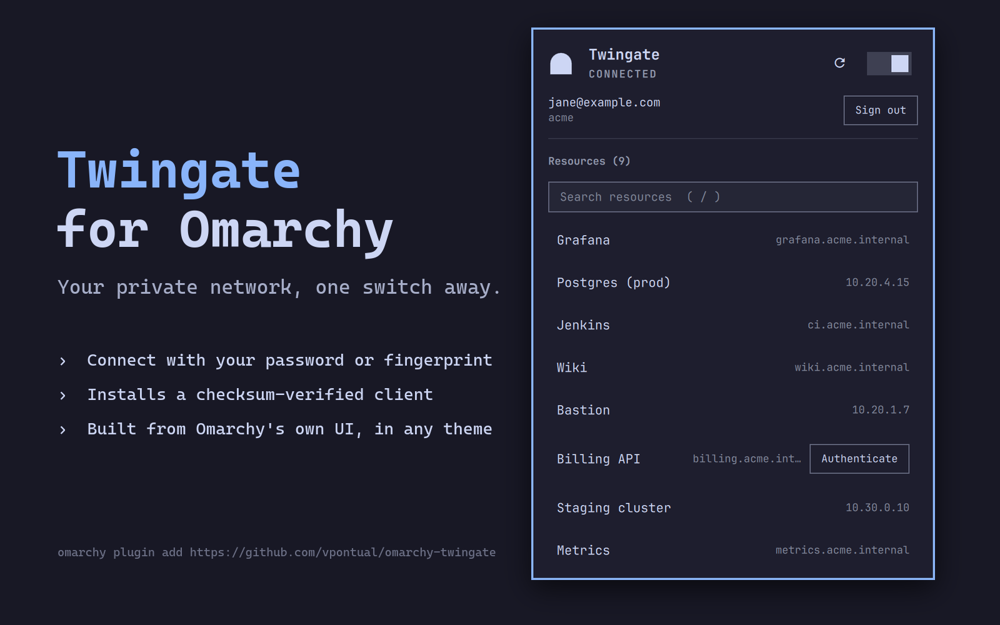

# Twingate Omarchy Widget

Unofficial Omarchy bar widget for the [Twingate](https://www.twingate.com)
Zero Trust client.



## Install

```sh
omarchy plugin add https://github.com/vpontual/omarchy-twingate.git --enable
```

Then install the Twingate client, if you do not have it. The panel's
**Install Twingate client** button downloads a **pinned version**, verifies its
**SHA-256** and refuses to install on mismatch, then hands it to `pacman` —
which still asks you to confirm.

Pinned client: **2026.190.6704**

| Architecture | SHA-256 |
|---|---|
| `x86_64` | `7b1a3fc6ada23940d6df45d2521143d46ceb0c91797c0959c4621656f7d25ae1` |
| `aarch64` | `0886076ef9bd4a85d8a0e10f4e0d3a551307a98efeb1cad7e02e3a90ace4c90a` |

Those digests are in [`Model.js`](Model.js) and are checked before `pacman` ever
sees the file. Twingate publishes no signature of its own, so this digest is the
only integrity control in the chain — which is why the plugin verifies it rather
than trusting the download. The URL carries an explicit version rather than the
mutable `stable` path, and the digest is what actually guarantees the bytes.

To do it yourself instead:

These match what the in-panel installer does, including the transfer limits —
https only on the request *and* on any redirect, and a ceiling at the exact
published size, so a hijacked answer cannot spend your disk before the checksum
gets a chance to reject it.

```sh
# x86_64 (10473309 bytes)
curl -fL --proto '=https' --proto-redir '=https' --max-redirs 5 \
     --max-filesize 10473309 -O \
     https://binaries.twingate.com/client/linux/ARCH/x86_64/2026.190.6704/twingate-amd64.pkg.tar.zst
printf '%s  %s\n' '7b1a3fc6ada23940d6df45d2521143d46ceb0c91797c0959c4621656f7d25ae1' 'twingate-amd64.pkg.tar.zst' | sha256sum -c -
sudo pacman -U twingate-amd64.pkg.tar.zst

# aarch64 (10492572 bytes)
curl -fL --proto '=https' --proto-redir '=https' --max-redirs 5 \
     --max-filesize 10492572 -O \
     https://binaries.twingate.com/client/linux/ARCH/aarch64/2026.190.6704/twingate-arm64.pkg.tar.zst
printf '%s  %s\n' '0886076ef9bd4a85d8a0e10f4e0d3a551307a98efeb1cad7e02e3a90ace4c90a' 'twingate-arm64.pkg.tar.zst' | sha256sum -c -
sudo pacman -U twingate-arm64.pkg.tar.zst
```

Point the client at your network once — the plugin cannot know its name:

```sh
twingate setup
```

Then turn the switch on. It starts the daemon, connects, and opens the sign-in
page in your browser.

## Features

- Shows Twingate connection state in the bar
- One switch: connects, disconnects, and starts the daemon when needed — in a
  single terminal run under one sudo prompt
- Opens the sign-in page for you when authentication is needed
- Offers to start Twingate at boot (the unit ships disabled on Arch)
- Browses your authorized resources from `twingate resources`
- Click a resource to copy its address; the row confirms
- Installs the Twingate client for you, from a version-pinned package whose
  checksum is verified before anything is installed
- Left click opens a keyboard-friendly panel

## Keyboard shortcuts

Inside the panel:

- `↑` / `↓`: move cursor
- `enter` / `c`: copy the selected resource's address
- `o`: open the selected resource in a browser
- `t`: toggle the connection
- `r`: refresh
- `esc`: close

On the bar icon: left click opens the panel, right click toggles the
connection, middle click refreshes.

## Requirements

- `twingate` CLI on `PATH`
- Omarchy 4 (Quattro) or newer
- `wl-copy` for clipboard actions
- `gum` for the start-at-boot prompt (ships with Omarchy)
- `curl`, `sha256sum`, `mktemp` and `pacman` if you use the in-panel installer

## Settings

```sh
omarchy bar set veepee.twingate refreshIntervalSec 30
omarchy bar move veepee.twingate --section right
```

| Key | Default | Values |
|---|---|---|
| `refreshIntervalSec` | `10` | `5`–`3600` |
| `visibility` | `always` | `always`, `when-online`, `when-installed` |
| `resourceScope` | `default` | `default`, `all` (include hidden resources) |

## What it runs on your machine

Nothing privileged runs on its own. Every `sudo` happens in a floating
terminal where you type the password and can read what happened.

**Headless, on a timer:** `which twingate`, `twingate status -d`,
`twingate status -v -d` (only while authenticating), `twingate resources -d`
(only while the panel is open).

`which twingate` runs directly. The three whose output is parsed run inside a
small `bash` wrapper, because Quickshell's collector has no size limit: without
one, a broken or hostile `twingate` could grow the shell process without bound
before anything was parsed. The wrapper does exactly four things — it caps
stdout and stderr at 1 MiB each with `head -c` so a runaway CLI takes SIGPIPE,
keeps the two streams separate, clears `BASH_ENV` and `ENV` so nothing is
sourced on the way in, and bounds the whole call at 12 seconds with `timeout`.
The arguments are fixed constants, validated before use, and the CLI's own exit
code is preserved.

**In a terminal, only when you act:** `twingate start`, `twingate disconnect`,
`sudo twingate service-start`, `sudo systemctl enable twingate.service` (only if
you say yes), and — only if you press **Install Twingate client** — `curl` to
fetch the pinned package, `sha256sum -c` to verify it, and `sudo pacman -U` to
install it. The install aborts if the checksum does not match. `curl` is held
to https on both the request and any redirect, and to the exact published byte
count via `--max-filesize`, so a transfer cannot run away before the checksum
gets a chance to reject it.

**Also:** `omarchy-launch-browser` to open a sign-in page or a resource, and
`wl-copy` to copy an address.

## Updating

```sh
omarchy plugin update veepee.twingate
```

It shows you the diff, asks before applying, and rolls back automatically if
the new version fails validation.

## Removing

```sh
omarchy plugin remove veepee.twingate
```

Or **Setup → Plugins → Remove Plugin**. The Twingate client itself is
untouched.

## Troubleshooting

```sh
omarchy-shell veepee.twingate diagnostics          # full state as JSON
qs -p /usr/share/omarchy/shell log | grep twingate  # what the plugin logged
```

`diagnostics` reports whether the CLI was found, the state it parsed, the last
error it saw, and the settings in effect — enough to explain most problems
without reading the source.

## Icon

Renders a gateway natively in the theme colour: solid when connected, a hollow
arch when not, with a dot when the plugin cannot do its job. Deliberately not
a reproduction of, nor a lookalike of, Twingate's brand mark.

## Notes

Design rationale, CLI quirks worth knowing, and the measured findings behind
several decisions: [docs/NOTES.md](docs/NOTES.md).

## Trademark

Twingate is a trademark of Twingate Inc. This is an unofficial,
community-built plugin and is not affiliated with, endorsed by, or supported
by Twingate Inc.

## Licence

MIT — see [LICENSE](LICENSE).
